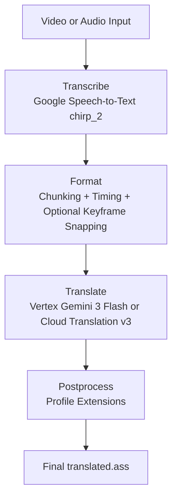

# autosub

Automatic Japanese subtitle generation and translation pipeline for speech-heavy video and audio.

## Current Pipeline

`autosub` currently runs a four-stage CLI pipeline:

1. **Transcribe**: Extract audio, send it to Google Cloud Speech-to-Text (`chirp_2`), and write a word-timed `transcript.json`.
2. **Format**: Chunk words into subtitle lines, optionally apply discourse-aware radio segmentation, apply timing and optional keyframe snapping, and write `original.ass`.
3. **Translate**: Translate subtitle events with either Vertex AI (`gemini-3-flash-preview`) or Cloud Translation v3, then write `translated.ass`.
4. **Postprocess**: Apply profile-driven editorial cleanup to the translated `.ass` file. The built-in `run` command includes this step automatically.



## Current Capabilities

- Word-level transcript timing from Google Speech-to-Text.
- Automatic short-audio local transcription and long-audio GCS batch transcription.
- Subtitle timing cleanup with minimum-duration padding, gap snapping, and optional keyframe alignment.
- Radio-show discourse extensions that can split listener mail framing and label subtitle roles.
- Optional bilingual output with original Japanese stacked above the translation.
- Profile inheritance for prompts, vocabulary, timing, and extensions.

## Current Limits

- The CLI is still documented and exposed as a **single-speaker** pipeline.
- `--speakers` and profile `speakers` values are parsed but currently ignored by the active CLI flow.
- The transcript and formatter can preserve `speaker` labels if they are already present in `transcript.json`, and `.ass` generation will create per-speaker styles, but diarization is not wired through the transcription commands yet.
- The formatter does **not** currently insert ASS line breaks (`\N`). Layout helpers exist in the codebase, but profile options such as `max_line_width` and `max_lines_per_subtitle` are not currently consumed by the CLI pipeline.

## Prerequisites

1. Python 3.12+
2. `uv`
3. FFmpeg available on `PATH`
4. Google Cloud credentials with:
   - `GOOGLE_APPLICATION_CREDENTIALS`
   - `GOOGLE_CLOUD_PROJECT`
   - `AUTOSUB_GCS_BUCKET` for audio longer than about 60 seconds
5. Optional: `SCXvid` if you want automatic keyframe extraction for scene-aware timing

## Installation

```powershell
git clone https://github.com/yourusername/autosub.git
Set-Location autosub
uv sync
```

## Configuration

Create a `.env` file in the repo root:

```dotenv
GOOGLE_APPLICATION_CREDENTIALS=C:\path\to\service-account.json
GOOGLE_CLOUD_PROJECT=your-project-id
AUTOSUB_GCS_BUCKET=your-staging-bucket
```

## Quick Start

Run the full pipeline:

```powershell
uv run autosub run .\video.mp4 --profile suzuhara_nozomi
```

For bilingual output:

```powershell
uv run autosub run .\video.mp4 --profile suzuhara_nozomi --bilingual
```

By default, `run` writes these files next to the input media, named after the video stem:

- `<stem>_transcript.json`
- `<stem>_original.ass`
- `<stem>_translated.ass`

If keyframe extraction is enabled and succeeds, it also writes `<stem>_keyframes.log`.
If `--save-log` is enabled, it writes `<stem>_autosub.log`.

## Running Stages Individually

Transcribe:

```powershell
uv run autosub transcribe .\video.mp4 `
  --out .\transcript.json `
  --profile suzuhara_nozomi
```

Format with an existing keyframe log:

```powershell
uv run autosub format .\transcript.json `
  --out .\original.ass `
  --keyframes .\video_keyframes.log `
  --fps 23.976 `
  --profile suzuhara_nozomi
```

Translate with Vertex AI:

```powershell
uv run autosub translate .\original.ass `
  --out .\translated.ass `
  --profile suzuhara_nozomi `
  --engine vertex `
  --bilingual
```

Postprocess a translated file explicitly:

```powershell
uv run autosub postprocess .\translated.ass `
  --profile suzuhara_nozomi `
  --bilingual
```

## Command Reference

### `autosub transcribe`

- `--out`, `-o`: Output transcript path. Default: `transcript.json`
- `--language`, `-l`: Speech recognition language code. Default: `ja-JP`
- `--vocab`, `-v`: Additional speech adaptation hints. Can be passed multiple times.
- `--profile`: Loads profile vocabulary.
- `--speakers`, `-s`: Reserved for future diarization support. Currently ignored.

Behavior notes:

- Audio shorter than about 60 seconds is sent directly to the API.
- Longer audio is uploaded to GCS first and transcribed as a batch job.

### `autosub format`

- `--out`: Output `.ass` path. Default: `original.ass` in the transcript directory
- `--keyframes`: Path to an Aegisub keyframe log
- `--fps`: Required when `--keyframes` is used
- `--profile`: Loads `[timing]` and `[extensions]`

Behavior notes:

- Chunking is punctuation- and pause-aware.
- If speaker labels are already present in the transcript JSON, chunking is done per speaker and the generated `.ass` file gets one style per speaker.
- The `radio_discourse` extension runs here when enabled.

### `autosub translate`

- `--out`: Output `.ass` path. Default: `translated.ass`
- `--engine`, `-e`: `vertex` or `cloud-v3`
- `--prompt`, `-p`: Extra translation guidance appended after profile prompts
- `--profile`: Loads prompt text from the selected profile
- `--target`: Target language code. Default: `en`
- `--source`: Source language code. Default: `ja`
- `--bilingual` / `--replace`: Stack Japanese above the translation, or replace text entirely
- `--chunk` / `--no-chunk`: Split translation into smaller chunks with retry logic. Useful for long files that cause API disconnects.
- `--chunk-size`: Number of subtitle lines per chunk. Default: `80`. Only used when `--chunk` is enabled.
- `--mark-chunks` / `--no-mark-chunks`: Insert ASS Comment events at artificial chunk boundaries so reviewers can spot lines where the LLM lost context. Only flags fixed-size and sub-split boundaries; corner-detected boundaries are excluded.
- `--save-log` / `--no-save-log`: Write full log output (at DEBUG level) to a `.log` file next to the output file.

Behavior notes:

- `vertex` uses Vertex AI with `gemini-3-flash-preview`.
- `cloud-v3` uses Google Cloud Translation v3 and ignores custom prompt text.
- `--chunk` splits the subtitle file into smaller API calls with exponential-backoff retry (3 attempts, 10s base delay). Recommended for files over ~200 lines. Checkpoints are saved so interrupted translations can resume.
- When the profile defines corners with cue phrases, chunking is corner-aware: chunks split at detected segment boundaries instead of fixed-size intervals.
- Vertex API errors include elapsed request time for diagnosing timeouts vs immediate connection failures.

### `autosub postprocess`

- `--out`: Output `.ass` path. Default: overwrite the input file
- `--profile`: Loads `[extensions]`
- `--bilingual` / `--replace`: Tells postprocess whether it is operating on stacked bilingual text or translated-only text

Behavior notes:

- Postprocessing only changes files when an enabled extension actually makes edits.
- The built-in `run` command postprocesses `translated.ass` in place.

### `autosub run`

`run` combines the full pipeline above and accepts the main options from each stage:

- `--out-dir`
- `--language`
- `--profile`
- `--vocab`
- `--engine`
- `--prompt`
- `--target`
- `--source`
- `--bilingual` / `--replace`
- `--speakers` (currently ignored)
- `--keyframes`
- `--extract-keyframes` / `--no-extract-keyframes`
- `--chunk` / `--no-chunk`
- `--chunk-size`
- `--mark-chunks` / `--no-mark-chunks`
- `--save-log` / `--no-save-log`

## Unified Profile Format

Profiles live in [`profiles`](./profiles) and are loaded by name with `--profile <name>`.

Example:

```toml
extends = ["solo_seiyuu_radio"]

prompt = "prompts/suzuhara_nozomi.md"
vocab = [
    "鈴原希実",
    "のんちゃん",
]
speakers = 1

[timing]
min_duration_ms = 700
snap_threshold_ms = 250
conditional_snap_threshold_ms = 500

[extensions.radio_discourse]
enabled = true
engine = "hybrid"
model = "gemini-3-flash-preview"
scope = "full_script"
window_size = 10
window_overlap = 3
split_framing_phrases = true
label_roles = true
```

### Profile Keys

- `extends`: List of base profile names. Base profiles are loaded first.
- `prompt`: Either inline text or a path ending in `.md` or `.txt`. File contents are loaded into the translation prompt.
- `vocab`: List of speech adaptation hints. Inherited lists are appended.
- `speakers`: Parsed and inherited, but not currently used by the active CLI pipeline.
- `[timing]`: Timing options for the formatter.
- `[extensions]`: Nested extension configuration shared by formatting and postprocessing.

### Corners

Profiles can define recurring program segments (corners) that the LLM detects during translation:

```toml
[[corners]]
name = "Card Illustrations"
description = "Segment where hosts discuss character card art"
cues = ["カードイラスト", "イラストのコーナー"]

[[corners]]
name = "Song Watchalong"
description = "Segment where hosts watch and react to a 3DMV"
cues = ["3DMV", "MV見よう"]
```

Each corner has:

- `name`: Display name used in the output ASS comment marker.
- `description`: Context for the LLM to understand what the segment is about.
- `cues`: Japanese phrases that typically signal the start of this segment.

**Corner detection**: During translation, the LLM prepends `[CORNER: Name]` tags to the first line of each detected segment. These are parsed post-translation and inserted as ASS Comment events (green rows in Aegisub) with `effect="corner"`. Duplicate consecutive corners are automatically deduplicated.

**Corner-aware chunking**: When `--chunk` is enabled and the profile defines corners with cues, the chunker scans source text for cue phrases and splits at detected segment boundaries instead of fixed-size intervals. This keeps segments intact within chunks, improving translation quality and reducing duplicate corner detection at chunk boundaries. Falls back to fixed-size chunking when no cues are defined or no matches are found.

Corner names and cues are inherited and merged through profile `extends` chains.

### Prompt and Vocab Merge Rules

- Prompt fragments are concatenated in inheritance order: base profile first, child profile after that, then CLI `--prompt` last.
- Vocabulary entries are appended in the same order: base profile, child profile, then CLI `--vocab`.

### Timing Options Currently Wired Up

These keys are currently consumed by the formatter:

- `min_duration_ms`
- `snap_threshold_ms`
- `conditional_snap_threshold_ms`

No layout-related profile keys are currently wired into the CLI formatter.

## `radio_discourse` Extension

The built-in `radio_discourse` extension is designed for solo seiyuu radio or listener-mail style content.

During **formatting**, it can:

- split trailing framing phrases such as `といただきました。` into their own subtitle lines
- classify lines as `host`, `listener_mail`, or `host_meta`
- store the resolved role in the ASS event `Name` field

During **postprocessing**, it can:

- wrap translated `listener_mail` lines in quotation marks
- in bilingual mode, quote only the translated bottom line and leave the original Japanese untouched

Supported options:

- `enabled`: Turn the extension on
- `engine`: `rules`, `vertex`, or `hybrid`
- `model`: Vertex model name for `vertex` or `hybrid`
- `location`: Vertex region. Default: `us-central1`
- `scope`: `full_script` or windowed classification
- `window_size`: Window size for non-`full_script` classification
- `window_overlap`: Window overlap for non-`full_script` classification
- `split_framing_phrases`: Split host framing suffixes into separate lines before classification
- `label_roles`: Persist the resolved role onto subtitle events

`hybrid` uses rule-based labels first and falls back to them if Vertex classification fails.
