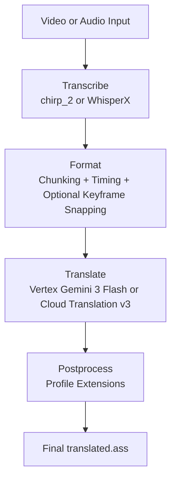

# autosub

Automatic Japanese subtitle generation and translation pipeline for speech-heavy video and audio.

## Current Pipeline

`autosub` currently runs a four-stage CLI pipeline:

1. **Transcribe**: Extract audio, send it to the selected transcription backend (`chirp_2` by default, optional local `whisperx`), and write a word-timed `transcript.json`.
2. **Format**: Chunk words into subtitle lines, optionally apply discourse-aware radio segmentation, apply timing and optional keyframe snapping, and write `original.ass`.
3. **Translate**: Translate subtitle events with either Vertex AI (`gemini-3-flash-preview`) or Cloud Translation v3, then write `translated.ass`.
4. **Postprocess**: Apply profile-driven editorial cleanup to the translated `.ass` file. The built-in `run` command includes this step automatically.



## Current Capabilities

- Word-level transcript timing from Google Speech-to-Text or WhisperX.
- Automatic short-audio local transcription and long-audio GCS batch transcription.
- Optional local WhisperX transcription that avoids Google-backed STT.
- Subtitle timing cleanup with minimum-duration padding, gap snapping, and optional keyframe alignment.
- Radio-show discourse extensions that can split listener mail framing and label subtitle roles.
- Optional bilingual output with original Japanese stacked above the translation.
- Profile inheritance for prompts, vocabulary, timing, and extensions.

## Current Limits

- The CLI is still documented and exposed as a **single-speaker** pipeline by default.
- The transcript and formatter can preserve `speaker` labels if they are already present in `transcript.json`, and `.ass` generation will create per-speaker styles, but diarization is not wired through the transcription commands yet.
- WhisperX is an alternate backend, not a parity backend for `chirp_2`; vocabulary hints, runtime characteristics, and recognition quality can differ.
- The formatter does **not** currently insert ASS line breaks (`\N`). Layout helpers exist in the codebase, but profile options such as `max_line_width` and `max_lines_per_subtitle` are not currently consumed by the CLI pipeline.

## Prerequisites

1. Python 3.12+
2. `uv`
3. FFmpeg available on `PATH`
4. Credentials for the services you plan to use:
   - Google Cloud for transcription, Cloud Translation v3, or `google-vertex`
   - `ANTHROPIC_API_KEY` for direct Anthropic translation or classification
   - `OPENAI_API_KEY` for direct OpenAI translation or classification
5. Optional for local WhisperX transcription:
   - install the optional extra with `uv sync --extra whisperx`
   - a working PyTorch/CUDA setup if you want GPU transcription
   - `HF_TOKEN` or `--whisper-hf-token` if you enable WhisperX diarization
6. Google Cloud credentials when using Google-backed features:
   - `GOOGLE_APPLICATION_CREDENTIALS`
   - `GOOGLE_CLOUD_PROJECT`
   - `AUTOSUB_GCS_BUCKET` for audio longer than about 60 seconds
7. Optional: `SCXvid` if you want automatic keyframe extraction for scene-aware timing

## Installation

```powershell
git clone https://github.com/yourusername/autosub.git
Set-Location autosub
uv sync
```

To enable the optional local WhisperX backend:

```powershell
uv sync --extra whisperx
```

If you want GPU WhisperX on Windows, keep `whisperx` as the optional repo extra and then replace any CPU-only PyTorch packages in the same repo environment with the matching CUDA-enabled build:

```powershell
uv pip uninstall torch torchvision torchaudio
uv pip install --index-url https://download.pytorch.org/whl/cu128 torch torchvision torchaudio
```

Notes:

- This PyTorch step is intentionally **not** in `pyproject.toml`, because the correct wheel depends on the user's platform and CUDA version.
- `uv sync --extra whisperx` can leave you with a CPU-only `torch` build from dependency resolution, so GPU users must replace it explicitly.
- `uv sync --extra whisperx` installs the WhisperX package, but the large Whisper/alignment models are still downloaded later on first use.
- If you do not want GPU acceleration, skip the PyTorch CUDA wheel install and run WhisperX with `--whisper-device cpu`.
- Verify the result before running a long transcription:

```powershell
uv run python -c "import torch; print(torch.__version__); print(torch.version.cuda); print(torch.cuda.is_available())"
```

You want to see a CUDA-tagged build such as `+cu128`, a non-`None` CUDA version, and `True`.

## Configuration

Create a `.env` file in the repo root:

```dotenv
GOOGLE_APPLICATION_CREDENTIALS=C:\path\to\service-account.json
GOOGLE_CLOUD_PROJECT=your-project-id
AUTOSUB_GCS_BUCKET=your-staging-bucket
ANTHROPIC_API_KEY=your-anthropic-api-key
OPENAI_API_KEY=your-openai-api-key
OPENROUTER_API_KEY=your-openrouter-api-key
```

Notes:

- `ANTHROPIC_API_KEY` is only needed for `--llm-provider anthropic`.
- `GOOGLE_CLOUD_PROJECT` is also enough for Claude when you use `--llm-provider anthropic-vertex`.
- `OPENAI_API_KEY` is only needed for `--llm-provider openai`.
- `OPENROUTER_API_KEY` is only needed for `--llm-provider openrouter`, or when `--model` falls back to OpenRouter because no higher-priority compatible provider is credentialed.
- `GOOGLE_APPLICATION_CREDENTIALS`, `GOOGLE_CLOUD_PROJECT`, and `AUTOSUB_GCS_BUCKET` are only needed for Google-backed stages.
- Long-audio transcription only requires Google Cloud Storage when using the default `chirp_2` backend.

Set up local-only working files like this:

```powershell
Copy-Item .\config.toml.sample .\config.toml
New-Item -ItemType Directory -Force .\profiles\local | Out-Null
New-Item -ItemType Directory -Force .\prompts\local | Out-Null
```

Then choose one of these workflows:

- Use a tracked example profile as-is. Example profiles in `.\profiles\examples` and prompt files in `.\prompts\examples` are committed and ready to use directly.
- Make your own local profile by copying an example into `.\profiles\local\my_profile.toml` and editing it.
- Only create a file in `.\prompts\local` when you want to override prompt text locally. You do not need to copy every example prompt up front.

Example local profile setup:

```powershell
Copy-Item .\profiles\examples\solo_seiyuu_radio.toml .\profiles\local\my_profile.toml
```

If `my_profile.toml` contains `prompt = "prompts/solo_seiyuu_radio.md"`, autosub will automatically prefer `.\prompts\local\solo_seiyuu_radio.md` over the tracked example file if both exist.

`.\config.toml`, `.\profiles\local\*.toml`, and `.\prompts\local\*` are gitignored on purpose, so you do not need to recommit them whenever you add or tweak a profile or prompt.

## Quick Start

Run the full pipeline:

```powershell
uv run autosub run .\video.mp4 --profile suzuhara_nozomi
```

For bilingual output:

```powershell
uv run autosub run .\video.mp4 --profile suzuhara_nozomi --bilingual
```

By default, `run` writes these files next to the input media, named after the video stem:

- `<stem>_transcript.json`
- `<stem>_original.ass`
- `<stem>_original.normalizer.llm_trace.jsonl` when the format normalizer uses `engine = "llm"`
- `<stem>_original.normalizer.edit_audit.tsv` when the format normalizer uses `engine = "llm"`
- `<stem>_original.radio_discourse.llm_trace.jsonl` when the `radio_discourse` extension uses an LLM-backed engine
- `<stem>_original.corners.llm_trace.jsonl` when the `corners` extension uses an LLM-backed engine
- `<stem>_original.combined.llm_trace.jsonl` when `radio_discourse` and `corners` run through the combined LLM path
- `<stem>_translated.ass`
- `<stem>_translated.llm_trace.jsonl` when translation uses the Vertex LLM engine

If keyframe extraction is enabled and succeeds, it also writes `<stem>_keyframes.log`.
If `--save-log` is enabled, it writes `<stem>_autosub.log`.

Use WhisperX instead of Chirp 2:

```powershell
uv run autosub transcribe .\video.mp4 `
  --backend whisperx `
  --whisper-model large-v2 `
  --whisper-device cpu
```

Use WhisperX with GPU on Windows after installing a CUDA-enabled PyTorch wheel:

```powershell
uv run autosub transcribe .\video.mp4 `
  --backend whisperx `
  --whisper-model large-v2 `
  --whisper-device cuda `
  --whisper-compute-type float16
```

## Running Stages Individually

Transcribe:

```powershell
uv run autosub transcribe .\video.mp4 `
  --out .\transcript.json `
  --profile suzuhara_nozomi `
  --start 0 `
  --start 900 `
  --end 300 `
  --end 1200
```

Format with an existing keyframe log:

```powershell
uv run autosub format .\transcript.json `
  --out .\original.ass `
  --keyframes .\video_keyframes.log `
  --fps 23.976 `
  --profile suzuhara_nozomi
```

Translate with Anthropic:

```powershell
uv run autosub translate .\original.ass `
  --out .\translated.ass `
  --profile suzuhara_nozomi `
  --model claude-haiku-4-5 `
  --llm-reasoning-effort low `
  --bilingual
```

Translate with Anthropic Sonnet 4.6:

```powershell
uv run autosub translate .\original.ass `
  --out .\translated.ass `
  --profile suzuhara_nozomi `
  --model claude-sonnet-4-6 `
  --llm-reasoning-effort low `
  --chunk-size 20 `
  --bilingual
```

Translate with OpenAI:

```powershell
uv run autosub translate .\original.ass `
  --out .\translated.ass `
  --profile suzuhara_nozomi `
  --model gpt-5-mini `
  --llm-reasoning-effort low `
  --bilingual
```

Translate with OpenRouter explicitly:

```powershell
uv run autosub translate .\original.ass `
  --out .\translated.ass `
  --profile suzuhara_nozomi `
  --llm-provider openrouter `
  --model anthropic/claude-sonnet-4-6 `
  --llm-reasoning-effort low `
  --bilingual
```

Translate with an OpenRouter-native model ID:

```powershell
uv run autosub translate .\original.ass `
  --out .\translated.ass `
  --llm-provider openrouter `
  --model qwen/qwen3.6-plus:free
```

## Model Selection

For a roughly 30 minute solo seiyuu radio episode, expect the translation stage to send around 20,000 input tokens in one request if you do not enable chunking. Output token usage varies more: concise runs stay relatively small, while higher-thinking runs can use substantially more output budget because reasoning tokens are billed as output tokens by some providers.

Practical recommendations:

- `gemini-3-flash-preview` is the default for a reason. It is the best starting point if you want a good balance of cost and quality.
- `claude-sonnet-4-6` and `gpt-5.4` are reasonable next steps if you want a small quality bump and are willing to pay more.
- Frontier-tier models are currently untested in this repo. They may work, but do not assume the prompts, structured output behavior, or chunking expectations have been tuned for them yet.
- Be especially careful with `gpt-5.4-pro`. As of April 1, 2026, OpenAI's API pricing page lists it far above `gpt-5.4`, so the cost jump is much larger than the likely quality jump for this workflow.

Current vendor pricing and model pages can change. Check the official docs before large runs:

- Google Vertex AI generative AI pricing: https://cloud.google.com/vertex-ai/generative-ai/pricing
- Anthropic pricing: https://docs.anthropic.com/en/docs/about-claude/pricing
- OpenAI API pricing: https://platform.openai.com/docs/pricing

Postprocess a translated file explicitly:

```powershell
uv run autosub postprocess .\translated.ass `
  --profile suzuhara_nozomi `
  --bilingual
```

## Default CLI Config

`autosub` auto-loads `.\config.toml` when that file exists.

Precedence is:

- explicit CLI flags
- `config.toml`
- built-in command defaults

The repo ships a sample at [`config.toml.sample`](./config.toml.sample). Copy it to `.\config.toml` before real use.

```powershell
Copy-Item .\config.toml.sample .\config.toml
```

You can override the path with `--config .\some-other.toml` or disable config loading for one run with `--no-config`.

`config.toml.sample` has one section per pipeline stage command:

- `[transcribe]`
- `[format]`
- `[translate]`
- `[postprocess]`

`autosub run` derives its defaults from those stage sections automatically, so it does not need its own config block in the normal case.

Use `config.toml` for command-line defaults you want every run to inherit, especially:

- `profile`
- `model`
- `llm_provider`
- `reasoning_effort`
- `bilingual`
- `chunk_size`
- `start` / `end`

For `autosub run`, the effective defaults are combined from the stage sections:

- transcription flags such as `language`, `vocab`, `profile`, `start`, and `end` come from `[transcribe]`
- formatting flags such as `keyframes` and `profile` come from `[format]`
- translation flags such as `prompt`, `target`, `source`, `model`, `llm_provider`, `reasoning_effort`, `bilingual`, and `chunk_size` come from `[translate]`
- if `[translate]` does not set `bilingual`, `run` falls back to `[postprocess].bilingual`

If you need a run-only override such as `out_dir` or `extract_keyframes`, an optional `[run]` section is still supported, but the default template leaves it out on purpose.

Keep reusable content in profiles and prompt files instead:

- prompt text
- vocabulary lists
- glossary entries
- timing rules
- replacements
- extension settings

Tracked example prompt fragments live in [`prompts/examples`](./prompts/examples). Local prompt overrides live in `.\prompts\local`, which is gitignored.

## Command Reference

### `autosub transcribe`

- `--out`, `-o`: Output transcript path. Default: `transcript.json`
- `--language`, `-l`: Speech recognition language code. Default: `ja-JP`
- `--backend` / `--transcription-backend`: `chirp_2` or `whisperx`
- `--vocab`, `-v`: Additional speech adaptation hints. Can be passed multiple times.
- `--profile`: Loads `[transcribe].vocab`.
- `--whisper-model`: WhisperX model name when `--backend whisperx` is selected
- `--whisper-device`: WhisperX device, usually `cpu` or `cuda`
- `--whisper-compute-type`: WhisperX/CTranslate2 compute type such as `int8` or `float16`
- `--whisper-batch-size`: WhisperX batch size
- `--whisper-diarize` / `--no-whisper-diarize`: Enable or disable WhisperX diarization
- `--whisper-hf-token`: Optional Hugging Face token for WhisperX diarization
- `--start`: Start time for transcription. Can be passed multiple times and pairs by order with `--end`.
- `--end`: End time for transcription. Can be passed multiple times and pairs by order with `--start`.

Behavior notes:

- Audio shorter than about 60 seconds is sent directly to the API.
- Longer audio is uploaded to GCS first and transcribed as a batch job.
- WhisperX runs locally on the extracted segment audio and does not use GCS.
- `--vocab` and profile vocabulary currently only affect `chirp_2`; WhisperX ignores them.
- Repeated `--start` and `--end` flags are grouped by position, so `--start 0 --start 15 --end 5 --end 20` transcribes `0-5` and `15-20`.
- When multiple ranges are provided, segment transcription requests are merged back into original video timestamps. `chirp_2` ranges run concurrently; WhisperX ranges currently run one at a time to avoid repeated heavy local model loads.

### `autosub format`

- `--out`: Output `.ass` path. Default: `original.ass` in the transcript directory
- `--keyframes`: Path to an Aegisub keyframe log
- `--fps`: Required when `--keyframes` is used
- `--profile`: Loads `[format]`, including timing keys, replacements, and extensions

Behavior notes:

- Chunking is punctuation- and pause-aware.
- If speaker labels are already present in the transcript JSON, chunking is done per speaker and the generated `.ass` file gets one style per speaker.
- Exact and LLM normalization run before timing cleanup and before `radio_discourse` greeting splitting.
- When normalization changes tokenization, autosub also rewrites the per-line `words` list so downstream split timing can use merged word timestamps directly.
- LLM normalizer runs can emit both a JSONL trace and a TSV edit audit alongside the formatted `.ass`.
- The `radio_discourse` extension runs here when enabled.

### `autosub translate`

- `--out`: Output `.ass` path. Default: `translated.ass`
- `--engine`, `-e`: `vertex` or `cloud-v3`
- `--model`: Preferred LLM selector for the `vertex` engine. Infers provider automatically for Gemini, Claude, and OpenAI model names
- `--llm-provider`: `google-vertex`, `anthropic-vertex`, `anthropic`, `openai`, or `openrouter` for the `vertex` engine
- `--prompt`, `-p`: Extra translation guidance appended after profile prompts
- `--profile`: Loads `[translate]`, including prompt text and glossary entries
- `--target`: Target language code. Default: `en`
- `--source`: Source language code. Default: `ja`
- `--llm-model` / `--vertex-model`: Override the LLM model name. Defaults to `gemini-3-flash-preview` for `google-vertex`, `claude-haiku-4-5` for both `anthropic-vertex` and `anthropic`, `gpt-5-mini` for `openai`, and `openai/gpt-5-mini` for `openrouter`
- `--llm-location` / `--vertex-location`: Override the LLM location or region
- `--llm-reasoning-effort`: Provider-agnostic reasoning effort for LLM-backed translation. Current support varies by provider and model family and can include `off`, `minimal`, `low`, `medium`, `high`
- `--llm-reasoning-budget`: Optional token-budget override for provider-specific reasoning controls
- `--llm-reasoning-dynamic` / `--no-llm-reasoning-dynamic`: Request dynamic reasoning budget on supported providers and model families
- `--bilingual` / `--replace`: Stack Japanese above the translation, or replace text entirely
- `--chunk-size`: Number of subtitle lines per translation chunk. Use `0` to disable chunking. Default: `0`
- `--mark-chunks` / `--no-mark-chunks`: Insert ASS Comment events at artificial chunk boundaries so reviewers can spot lines where the LLM lost context. Only flags fixed-size and sub-split boundaries; corner-detected boundaries are excluded.
- `--save-log` / `--no-save-log`: Write full log output (at DEBUG level) to a `.log` file next to the output file.

Behavior notes:

- `vertex` uses the structured LLM path. The default provider is Vertex AI with `gemini-3-flash-preview`, and Vertex-routed Claude, direct Anthropic, OpenAI, and OpenRouter are also supported.
- `cloud-v3` uses Google Cloud Translation v3 and ignores custom prompt text.
- The older `--vertex-reasoning-*` spellings still work as legacy aliases, but `--llm-reasoning-*` is the preferred public interface now.
- `--model` now resolves in two steps: identify a supported model family, then choose a compatible credentialed provider.
- Supported family shortcuts are currently `gemini-*`, `claude-*`, `gpt-*`, `chatgpt*`, and OpenAI `o`-series names like `o3` or `o4-mini`.
- When more than one compatible provider is credentialed, autosub prefers `google-vertex`, then `anthropic-vertex`, then `anthropic`, then `openai`, then `openrouter`.
- `--llm-provider` always overrides automatic provider selection.
- OpenRouter-native `vendor/model` IDs such as `qwen/qwen3.6-plus:free` are accepted directly. If `OPENROUTER_API_KEY` is available, bare vendor-prefixed model IDs also auto-resolve to OpenRouter.
- `--model` cannot be combined with `--engine cloud-v3`.
- When the profile defines corners with cue phrases, chunking is corner-aware: chunks split at detected segment boundaries instead of fixed-size intervals.
- Vertex API errors include elapsed request time for diagnosing timeouts vs immediate connection failures.

Anthropic notes:

- Supported direct Anthropic models include `claude-haiku-4-5`, `claude-sonnet-4-6`, and `claude-opus-4-6`.
- When `--llm-provider anthropic` is selected and `--llm-model` is omitted, the default model is `claude-haiku-4-5`.
- For longer or stricter JSON-heavy translation jobs, `claude-sonnet-4-6` is usually more reliable than Haiku.
- `--llm-location` is ignored for direct Anthropic requests.
- Direct Anthropic uses the same `--llm-reasoning-effort` flag as the other providers.

Anthropic Vertex notes:

- `--llm-provider anthropic-vertex` uses Claude through Vertex AI credentials instead of `ANTHROPIC_API_KEY`.
- `GOOGLE_CLOUD_PROJECT` is required for `anthropic-vertex`, and `--llm-location` controls the Vertex region.
- When `--llm-provider anthropic-vertex` is selected and `--llm-model` is omitted, the default model is `claude-haiku-4-5`.
- Claude model shortcuts such as `claude-haiku-4-5` and `claude-sonnet-4-6` can now auto-resolve to `anthropic-vertex` when Google credentials are available but direct Anthropic credentials are not.

Current Anthropic reasoning defaults in this repo:

- `minimal`: thinking budget `2048`, `max_tokens 65536`
- `low`: thinking budget `4096`, `max_tokens 65536`
- `medium`: thinking budget `16384`, `max_tokens 65536`
- `high`: thinking budget `32768`, `max_tokens 65536`

OpenAI notes:

- Direct OpenAI currently defaults to `gpt-5-mini` when `--llm-provider openai` is selected and `--llm-model` is omitted.
- `--llm-location` is ignored for direct OpenAI requests.
- OpenAI uses the same `--llm-reasoning-effort` flag as the other providers.
- `--llm-reasoning-budget` is currently ignored for OpenAI. Use reasoning effort only.

OpenRouter notes:

- OpenRouter currently defaults to `openai/gpt-5-mini` when `--llm-provider openrouter` is selected and `--llm-model` is omitted.
- For recognized bare model families, autosub rewrites the model to the OpenRouter vendor-prefixed form automatically when OpenRouter is selected. For example, `gpt-5-mini` becomes `openai/gpt-5-mini`, and `claude-sonnet-4-6` becomes `anthropic/claude-sonnet-4-6`.
- You can also pass OpenRouter-native model IDs directly, such as `qwen/qwen3.6-plus:free`.
- OpenRouter uses the same `--llm-reasoning-effort` flag as the other providers.
- `--llm-location` is ignored for OpenRouter requests.

### `autosub postprocess`

- `--out`: Output `.ass` path. Default: overwrite the input file
- `--profile`: Loads `[postprocess.extensions]`
- `--bilingual` / `--replace`: Tells postprocess whether it is operating on stacked bilingual text or translated-only text

Behavior notes:

- Postprocessing only changes files when an enabled extension actually makes edits.
- The built-in `run` command postprocesses `translated.ass` in place.

### `autosub run`

`run` combines the full pipeline above and keeps the common end-to-end options:

- `--out-dir`
- `--language`
- `--profile`
- `--vocab`
- `--prompt`
- `--target`
- `--source`
- `--llm-reasoning-effort`
- `--llm-provider`
- `--bilingual` / `--replace`
- `--keyframes`
- `--extract-keyframes` / `--no-extract-keyframes`
- `--start`
- `--end`
- `--chunk-size`
- `--mark-chunks` / `--no-mark-chunks`
- `--save-log` / `--no-save-log`

Behavior notes:

- `run` defaults to the Vertex AI translation path, but you can switch to Vertex-routed Claude with `--llm-provider anthropic-vertex` or direct Anthropic with `--llm-provider anthropic`.
- `run` uses the same model resolution rules as `translate`, including credential-aware fallback to OpenRouter for supported model families.
- If you need `cloud-v3` or advanced LLM overrides such as model, location, or dynamic reasoning settings, run the stages separately and use `autosub translate`.
- Repeated `--start` and `--end` flags behave the same as `autosub transcribe`, and the selected transcription segments run concurrently before the downstream stages continue.

Example:

```powershell
uv run autosub run .\video.mp4 `
  --profile suzuhara_nozomi `
  --model claude-haiku-4-5 `
  --llm-reasoning-effort low `
  --bilingual
```

## Unified Profile Format

Tracked example profiles live in [`profiles/examples`](./profiles/examples). Local working profiles live in `.\profiles\local`, which is gitignored. `--profile <name>` searches in this order:

- `profiles\local\<name>.toml`
- `profiles\examples\<name>.toml`
- `profiles\<name>.toml` for backward compatibility

To create a local profile from a tracked example:

```powershell
Copy-Item .\profiles\examples\solo_seiyuu_radio.toml .\profiles\local\my_profile.toml
```

If a profile prompt entry points at `prompts\<name>.md` or `prompts\<name>.txt`, autosub searches in this order:

- `prompts\local\<name>.md`
- `prompts\examples\<name>.md`
- `prompts\<name>.md` for backward compatibility

You do not need to change the profile path to `prompts\local\...`. Keep the profile entry as `prompts\foo.md`; autosub will check `prompts\local\foo.md` first automatically.

Example:

```toml
extends = ["solo_seiyuu_radio"]

[transcribe]
vocab = ["鈴原希実", "のんちゃん"]

[format]
min_duration_ms = 700
snap_threshold_ms = 250
conditional_snap_threshold_ms = 500

[format.normalizer]
engine = "llm"
provider = "google-vertex"
model = "gemini-2.5-flash-lite"
reasoning_effort = "minimal"
allow_llm_correction = true

[[format.normalizer.terms]]
value = "鈴原希実"
explanation = "Host name. Common ASR confusions include のぞみ, のすみ, and のソミ."

[[format.normalizer.terms]]
value = "のんばんは"
explanation = "Show greeting catchphrase. Often confused with こんばんは or の番は."

[format.extensions.radio_discourse]
enabled = true
engine = "hybrid"
provider = "anthropic-vertex"
model = "claude-haiku-4-5"
reasoning_effort = "low"
scope = "full_script"
window_size = 10
window_overlap = 3
split_framing_phrases = true
label_roles = true

[translate]
prompt = "prompts/suzuhara_nozomi.md"

[translate.glossary]
"鈴原希実" = "Suzuhara Nozomi"

[postprocess.extensions.radio_discourse]
enabled = true
```

### Profile Keys

- `extends`: List of base profile names. Base profiles are loaded first.
- `[transcribe].vocab`: List of speech adaptation hints. Inherited lists are appended.
- `[format]`: Formatter-specific settings. Timing keys such as `min_duration_ms` live directly under this table.
- `[format.replacements]`: Exact deterministic replacements applied before formatting and timing rules. If `[format.normalizer]` is omitted, autosub treats this as the default exact normalizer.
- `[format.normalizer]`: Optional normalizer config. Set `engine = "exact"` to use a replacement map or `engine = "llm"` to let an LLM propose substring replacements from an approved term list.
- `[format.extensions]`: Nested extension configuration for the formatting stage.
- `[translate].prompt`: Either inline text or a path ending in `.md` or `.txt`. File contents are loaded into the translation prompt.
- `[translate.glossary]`: Exact translation overrides appended to the translation prompt.
- `[postprocess.extensions]`: Nested extension configuration for the postprocessing stage.

Legacy flat profile keys such as top-level `prompt`, `vocab`, `[timing]`, `[extensions]`, `[glossary]`, and `[replacements]` are still accepted for compatibility, but new profiles should use the staged layout above.

### Format Normalizer

Use one of these modes:

- Exact mode via `[format.replacements]`, or `[format.normalizer]` with `engine = "exact"`
- LLM mode via `[format.normalizer]` with `engine = "llm"`

LLM mode is mutually exclusive with `[format.replacements]`.

Exact mode example:

```toml
[format.replacements]
"鈴原のぞみ" = "鈴原希実"
"の番は" = "のんばんは"
```

LLM mode example:

```toml
[format.normalizer]
engine = "llm"
provider = "google-vertex"
model = "gemini-2.5-flash-lite"
reasoning_effort = "minimal"
allow_llm_correction = true

[[format.normalizer.terms]]
value = "鈴原希実"
explanation = "Host name. Common ASR confusions include のぞみ, のすみ, and のソミ."

[[format.normalizer.terms]]
value = "のんばんは"
explanation = "Show greeting catchphrase. Often confused with こんばんは or の番は."
```

Behavior notes:

- The LLM normalizer does not rewrite whole lines. It only proposes exact substring replacements.
- Each proposed edit is validated locally before autosub applies it.
- Validation checks both forward and reverse application order for multiple edits on the same line, then keeps the ordering with fewer failures.
- `allow_llm_correction = true` enables one extra correction pass when the first LLM response fails local validation. The correction prompt includes the rejected edits and the validation errors.
- LLM runs write a structured TSV edit audit with `line_id`, `source_text`, `replacement_text`, `start_char`, `end_char`, and `status`. Status values are `accepted`, `rejected`, `corrected`, or `repaired`.
- Exact and LLM normalization both preserve replacement spans for downstream offset-aware logic.
- Exact and LLM normalization both update `line.words` when the replacement changes tokenization, so downstream timing-sensitive features can use merged normalized words directly.
- `[[format.normalizer.terms]]` entries can include an optional `explanation` field for added context.
- `keywords = ["鈴原希実", "のんばんは"]` is also accepted as a shorthand when explanations are not needed.

### Corners

Profiles can define recurring program segments (corners) that the LLM detects during translation:

```toml
[[corners]]
name = "Card Illustrations"
description = "Segment where hosts discuss character card art"
cues = ["カードイラスト", "イラストのコーナー"]

[[corners]]
name = "Song Watchalong"
description = "Segment where hosts watch and react to a 3DMV"
cues = ["3DMV", "MV見よう"]
```

Each corner has:

- `name`: Display name used in the output ASS comment marker.
- `description`: Context for the LLM to understand what the segment is about.
- `cues`: Japanese phrases that typically signal the start of this segment.

**Corner detection**: During translation, the LLM prepends `[CORNER: Name]` tags to the first line of each detected segment. These are parsed post-translation and inserted as ASS Comment events (green rows in Aegisub) with `effect="corner"`. Duplicate consecutive corners are automatically deduplicated.

**Corner-aware chunking**: When `--chunk` is enabled and the profile defines corners with cues, the chunker scans source text for cue phrases and splits at detected segment boundaries instead of fixed-size intervals. This keeps segments intact within chunks, improving translation quality and reducing duplicate corner detection at chunk boundaries. Falls back to fixed-size chunking when no cues are defined or no matches are found.

Corner names and cues are inherited and merged through profile `extends` chains.

### Prompt and Vocab Merge Rules

- Prompt fragments from `[translate].prompt` are concatenated in inheritance order: base profile first, child profile after that, then CLI `--prompt` last.
- Vocabulary entries from `[transcribe].vocab` are appended in the same order: base profile, child profile, then CLI `--vocab`.
- `[translate.glossary]`, `[format.replacements]`, and timing keys under `[format]` override base profiles by key.
- `[format.normalizer].terms` are appended in inheritance order. Other `[format.normalizer]` keys override by key.
- `[format.extensions]` and `[postprocess.extensions]` are deep-merged by key.

### Timing Options Currently Wired Up

These keys are currently consumed by the formatter:

- `min_duration_ms`
- `snap_threshold_ms`
- `conditional_snap_threshold_ms`

No layout-related profile keys are currently wired into the CLI formatter.

## `radio_discourse` Extension

The built-in `radio_discourse` extension is designed for solo seiyuu radio or listener-mail style content.

During **formatting**, it can:

- split trailing framing phrases such as `といただきました。` into their own subtitle lines
- classify lines as `host`, `listener_mail`, or `host_meta`
- store the resolved role in the ASS event `Name` field

During **postprocessing**, it can:

- wrap translated `listener_mail` lines in quotation marks
- in bilingual mode, quote only the translated bottom line and leave the original Japanese untouched

Supported options:

- `enabled`: Turn the extension on
- `engine`: `rules`, `llm`, or `hybrid`
- `provider`: `google-vertex`, `anthropic-vertex`, `anthropic`, or `openai` for the LLM-backed modes
- `model`: LLM model name for `llm` or `hybrid`
- `reasoning_effort`: Provider-agnostic reasoning effort for LLM-backed classification. Current support varies by provider and model family and can include `off`, `minimal`, `low`, `medium`, `high`
- `reasoning_budget_tokens`: Optional token-budget override for provider-specific reasoning controls
- `reasoning_dynamic`: Request dynamic reasoning budget when the selected provider supports it
- `location`: LLM location or region. Default: `global`
- `scope`: `full_script` or windowed classification
- `window_size`: Window size for non-`full_script` classification
- `window_overlap`: Window overlap for non-`full_script` classification
- `split_framing_phrases`: Split host framing suffixes into separate lines before classification
- `label_roles`: Persist the resolved role onto subtitle events
- `greetings`: List of phrases after which the line is split before role classification (see below)

`hybrid` uses rule-based labels first and falls back to them if LLM classification fails.

### `greetings` splitting

`greetings` accepts a list of phrases. Any subtitle line containing one of those phrases is split immediately after the last character of the matching phrase, before role classification runs.

```toml
greetings = ["のんばんは", "こんにちは"]
```

Behavior notes:

- If the phrase is immediately followed by punctuation (`。！？!?、,`), that punctuation stays on the greeting line before the split.
- If the split-created greeting line does not already end with sentence punctuation, `。` is appended to that line.
- If the phrase ends exactly at the end of the line, no split is performed.
- Greetings are matched against post-normalization text, so an exact replacement like `"の番は" = "のんばんは"` or an LLM normalizer edit to `のんばんは` will correctly find and split lines where the original transcript used a mistranscribed variant.
- When normalization has already merged the affected words, greeting splitting uses that merged word timing directly. Otherwise it falls back to replacement-span remapping to recover the original word boundary.

Anthropic-backed `radio_discourse` example:

```toml
[format.extensions.radio_discourse]
enabled = true
engine = "hybrid"
provider = "anthropic"
model = "claude-haiku-4-5"
reasoning_effort = "low"
scope = "full_script"
split_framing_phrases = true
label_roles = true
```

Vertex-routed Anthropic `radio_discourse` example:

```toml
[format.extensions.radio_discourse]
enabled = true
engine = "hybrid"
provider = "anthropic-vertex"
model = "claude-haiku-4-5"
reasoning_effort = "low"
location = "global"
scope = "full_script"
split_framing_phrases = true
label_roles = true
```

OpenAI-backed `radio_discourse` example:

```toml
[format.extensions.radio_discourse]
enabled = true
engine = "hybrid"
provider = "openai"
model = "gpt-5-mini"
reasoning_effort = "low"
scope = "full_script"
split_framing_phrases = true
label_roles = true
```
